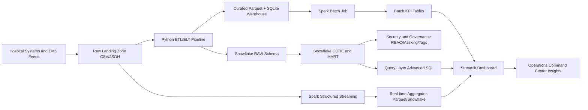

# Architecture

## Layers
- Sources: incident feeds, hospital reference data, and staffing data.
- Processing: Python ETL for conformed tables, Spark for larger batch and streaming workloads.
- Storage: local SQLite/parquet for dev, Snowflake for production analytics.
- Serving: SQL models and aggregates consumed by dashboard users.
- Governance: role-based access, masking, row policies, and tags.
- Consumption: dashboard and presentation outputs.
